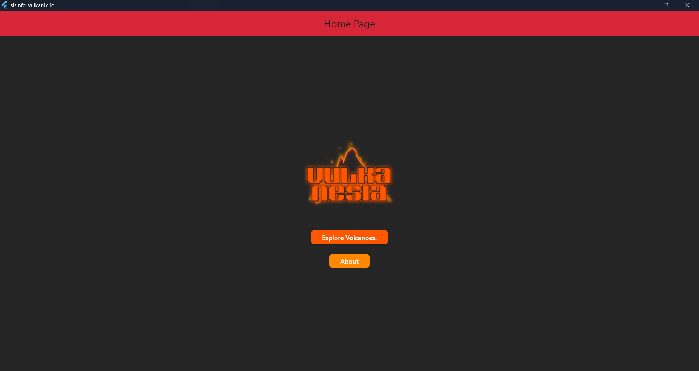
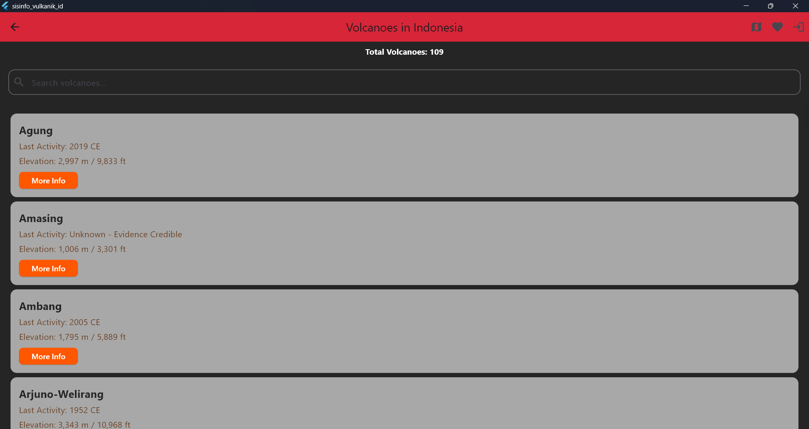
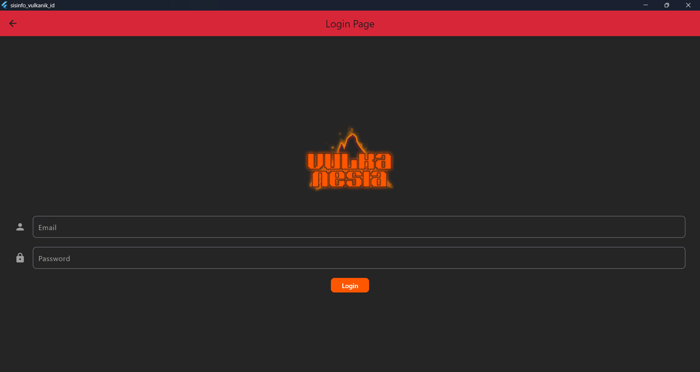
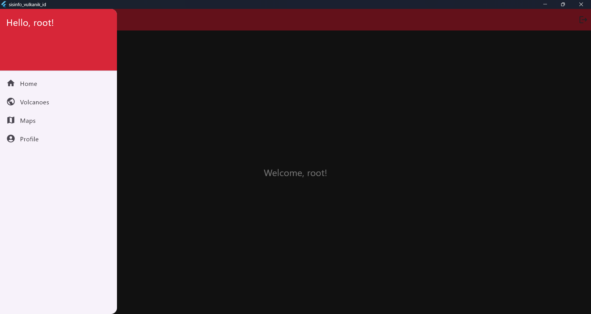

# VULKANESIA

VULKANESIA (Vulkano Indonesia) adalah aplikasi Sistem Informasi untuk Gunung api yang berada di Indonesia.

VULKANESIA menampilkan informasi tentang gunung api seperti:
- Nama Gunung
- Nomor Volcano
- Wilayah Vulkanis
- Bentuk Lahan
- Aktivitas terakhir gunung
- Tipe Vulkanik
- Populasi 100km sekitar gunung
- Pengaturan tektonik
- Kordinat garis lintang dan garis bujur
- Jenis Batu
- Elevasi gunung
- Gambar dari gunung
- Deskripsi Gunung

Fitur untuk membantu pengguna menggunakan VULKANESIA:
- Pencarian
- Tambah/Hapus dari favorit


## Menjalankan App (Developer)

Clone project flutter

```bash
  git clone https://github.com/xpossed-you/sisinfo_vulkanik_id
```

Buka folder hasil git clone tadi

```bash
  flutter run
```

Terminal akan mengeluarkan text seperti ini:

```bash
Windows (desktop) • windows • windows-x64    • Microsoft Windows [Version 10.0.26100.4061]
Chrome (web)      • chrome  • web-javascript • Google Chrome 136.0.7103.114
Edge (web)        • edge    • web-javascript • Microsoft Edge 136.0.3240.64
[1]: Windows (windows)
[2]: Chrome (chrome)
[3]: Edge (edge)
```

Masukkan pilihanmu untuk bagaimana aplikasi ini berjalan

## Menjalankan App (User biasa)

Download release dari hasil compile pembuat di link ini:
```bash
https://github.com/xpossed-you/sisinfo_vulkanik_id/releases
```

## Struktur Project
~~~
sisinfo_vulkanik_id/
-->/lib
----> about_page.dart
----> dashboard.dart
----> database_aplikasi.dart
----> home_page.dart
----> login.dart
----> main.dart
----> maps.dart
~~~

## Screenshots
Tampilan Homepage


Tampilan Daftar Gunung Api


Tampilan Login


Tampilan Dashboard

